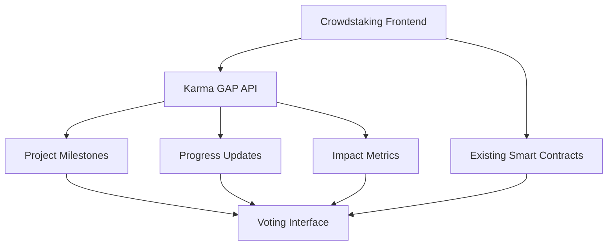

# Breadchain Crowdstaking × Karma GAP Integration Specifications

**Version:** 1.0  
**Date:** January 2025  
**Repository:** [BreadchainCoop/crowdstaking-v2](https://github.com/BreadchainCoop/crowdstaking-v2)  
**Live App:** [app.breadchain.xyz/governance](https://app.breadchain.xyz/governance)

## Table of Contents

1. [Overview](#overview)
2. [Technical Architecture](#technical-architecture)
3. [API Integration](#api-integration)
4. [Frontend Implementation](#frontend-implementation)
5. [Data Models](#data-models)
6. [User Experience Flow](#user-experience-flow)
7. [Implementation Phases](#implementation-phases)
8. [Complete Task List](#complete-task-list)
9. [Testing Strategy](#testing-strategy)
10. [Deployment Plan](#deployment-plan)

## Overview

### Objective
Integrate Karma GAP (Global Allocation Platform) with the Breadchain crowdstaking governance interface to provide voters with real-time project progress data, milestone updates, and impact metrics when making funding allocation decisions.

### Key Benefits
- **Informed Voting**: Voters can see project progress before allocating voting power
- **Accountability**: Projects demonstrate transparency through regular updates
- **Trust Building**: On-chain milestone tracking increases community confidence
- **Automated Insights**: Reduce manual due diligence through standardized reporting

### Current System
- **Frontend**: Next.js + React + TypeScript
- **Styling**: Tailwind CSS
- **Blockchain**: Gnosis Chain integration
- **Smart Contracts**: Voting and LP token staking contracts
- **Tokens**: BREAD token ecosystem with buttering/baking mechanics

## Technical Architecture

### Integration Points



### Data Flow
1. **Project Registration**: Member projects link their Karma GAP profiles
2. **Data Fetching**: Frontend periodically syncs project data from Karma GAP
3. **Enhanced Display**: Voting interface shows enriched project information
4. **Real-time Updates**: Webhook integration for immediate data refresh

## API Integration

### Karma GAP API Endpoints

Based on [Karma API Documentation](https://documenter.getpostman.com/view/36647319/2sAXxQdrkZ):

```typescript
// Core API endpoints to integrate
interface KarmaGAPEndpoints {
  projects: '/projects/{projectId}';
  milestones: '/projects/{projectId}/milestones';
  updates: '/projects/{projectId}/updates';
  impact: '/projects/{projectId}/impact';
  grants: '/projects/{projectId}/grants';
  attestations: '/projects/{projectId}/attestations';
}
```

### API Service Implementation

```typescript
// src/services/karmaGAP.ts
export class KarmaGAPService {
  private baseURL = 'https://api.karmahq.xyz/api';
  
  async getProjectData(projectId: string): Promise<ProjectWithGAPData> {
    // Implementation details
  }
  
  async getProjectMilestones(projectId: string): Promise<Milestone[]> {
    // Implementation details
  }
  
  async getProjectUpdates(projectId: string): Promise<Update[]> {
    // Implementation details
  }
}
```

## Frontend Implementation

### Enhanced Project Interface

```typescript
// src/types/karma.ts
interface ProjectWithGAPData {
  // Existing project data
  projectId: string;
  name: string;
  description: string;
  
  // Karma GAP integration
  karmaGAPId?: string;
  karmaGAPProfile?: {
    milestones: Milestone[];
    recentUpdates: Update[];
    impactMetrics: ImpactMetric[];
    lastUpdateDate: Date;
    completionRate: number;
    trustScore: number;
  };
}

interface Milestone {
  id: string;
  title: string;
  description: string;
  status: 'pending' | 'in_progress' | 'completed' | 'delayed';
  targetDate: Date;
  completedDate?: Date;
  attestationId?: string;
}

interface Update {
  id: string;
  title: string;
  content: string;
  publishedDate: Date;
  type: 'milestone' | 'progress' | 'announcement';
  attachments?: string[];
}

interface ImpactMetric {
  metric: string;
  value: number;
  unit: string;
  verificationSource: string;
  lastUpdated: Date;
}
```

### Enhanced Voting Components

#### 1. Project Card Enhancement
```typescript
// src/components/ProjectCard.tsx
interface ProjectCardProps {
  project: ProjectWithGAPData;
  onVote: (projectId: string, allocation: number) => void;
}

export const ProjectCard: React.FC<ProjectCardProps> = ({ project, onVote }) => {
  return (
    <div className="project-card">
      {/* Existing project info */}
      <ProjectBasicInfo project={project} />
      
      {/* New Karma GAP integration */}
      {project.karmaGAPProfile && (
        <KarmaGAPInsights profile={project.karmaGAPProfile} />
      )}
      
      {/* Voting interface */}
      <VotingControls project={project} onVote={onVote} />
    </div>
  );
};
```

#### 2. Karma GAP Insights Component
```typescript
// src/components/KarmaGAPInsights.tsx
export const KarmaGAPInsights: React.FC<{ profile: KarmaGAPProfile }> = ({ profile }) => {
  return (
    <div className="karma-gap-insights">
      <ProgressIndicator completionRate={profile.completionRate} />
      <RecentMilestones milestones={profile.milestones.slice(0, 3)} />
      <LastUpdateBadge lastUpdate={profile.lastUpdateDate} />
      <TrustScoreBadge score={profile.trustScore} />
    </div>
  );
};
```

#### 3. Detailed Project View
```typescript
// src/components/ProjectDetailModal.tsx
export const ProjectDetailModal: React.FC<{ project: ProjectWithGAPData }> = ({ project }) => {
  return (
    <Modal>
      <ProjectHeader project={project} />
      
      {project.karmaGAPProfile && (
        <div className="karma-gap-details">
          <MilestonesTimeline milestones={profile.milestones} />
          <UpdatesFeed updates={profile.recentUpdates} />
          <ImpactMetrics metrics={profile.impactMetrics} />
          <ExternalLink href={`https://gap.karmahq.xyz/project/${project.karmaGAPId}`}>
            View on Karma GAP
          </ExternalLink>
        </div>
      )}
    </Modal>
  );
};
```

## Data Models

### Database Schema Additions

```sql
-- Add Karma GAP integration to existing projects table
ALTER TABLE projects ADD COLUMN karma_gap_id VARCHAR(255);
ALTER TABLE projects ADD COLUMN karma_gap_data JSONB;
ALTER TABLE projects ADD COLUMN karma_gap_last_sync TIMESTAMP;

-- Create karma_gap_cache table for performance
CREATE TABLE karma_gap_cache (
  id SERIAL PRIMARY KEY,
  project_id VARCHAR(255) NOT NULL,
  karma_gap_id VARCHAR(255) NOT NULL,
  data_type VARCHAR(50) NOT NULL, -- 'milestones', 'updates', 'impact'
  data JSONB NOT NULL,
  cached_at TIMESTAMP DEFAULT NOW(),
  expires_at TIMESTAMP NOT NULL,
  UNIQUE(karma_gap_id, data_type)
);

-- Index for performance
CREATE INDEX idx_karma_gap_cache_lookup ON karma_gap_cache(karma_gap_id, data_type, expires_at);
```

### Configuration Updates

```typescript
// src/config/karma.ts
export const karmaGAPConfig = {
  apiBaseURL: process.env.NEXT_PUBLIC_KARMA_GAP_API_URL || 'https://api.karmahq.xyz/api',
  webhookSecret: process.env.KARMA_GAP_WEBHOOK_SECRET,
  cacheExpiry: {
    milestones: 24 * 60 * 60 * 1000, // 24 hours
    updates: 6 * 60 * 60 * 1000,     // 6 hours
    impact: 24 * 60 * 60 * 1000,     // 24 hours
  },
  retryConfig: {
    maxRetries: 3,
    backoffMultiplier: 2,
    initialDelay: 1000,
  },
};
```

## User Experience Flow

### For Voters

1. **Browse Projects**: Enhanced project cards show completion rates and recent activity
2. **Quick Assessment**: Trust scores and update frequency help rapid evaluation
3. **Detailed Review**: Click for full milestone history and impact metrics
4. **Informed Voting**: Make allocation decisions based on verified progress
5. **Follow Progress**: Receive notifications when supported projects post updates

### For Projects

1. **Profile Linking**: Connect Karma GAP profile during onboarding
2. **Regular Updates**: Maintain visibility through consistent milestone updates
3. **Verification**: Submit attestations for milestone completion
4. **Community Building**: Engage supporters through progress transparency
5. **Reputation Growth**: Build on-chain reputation across platforms

## Implementation Phases

### Phase 1: Foundation (Weeks 1-2)
- Set up Karma GAP API service
- Create basic data models
- Implement project linking functionality
- Add simple progress indicators to project cards

**Deliverables:**
- Karma GAP API service with error handling
- Database schema updates
- Basic project card enhancements
- Project profile linking interface

### Phase 2: Enhanced UI (Weeks 3-4)
- Implement detailed project views
- Add milestone timeline visualization
- Create trust score and activity indicators
- Implement real-time data updates

**Deliverables:**
- Project detail modal with Karma GAP data
- Milestone timeline component
- Trust score visualization
- Update notifications system

### Phase 3: Advanced Features (Weeks 5-6)
- Add filtering and sorting by activity level
- Implement automated project scoring
- Create admin tools for project management
- Add analytics and reporting

**Deliverables:**
- Advanced filtering system
- Project scoring algorithms
- Admin dashboard updates
- Analytics integration

### Phase 4: Integration & Polish (Weeks 7-8)
- Webhook integration for real-time updates
- Performance optimization
- Mobile responsiveness
- Documentation and testing

**Deliverables:**
- Webhook endpoint implementation
- Performance monitoring
- Mobile-optimized interface
- Complete documentation

## Complete Task List

### 🛠️ Infrastructure Setup

#### API Integration
- [ ] **Task 1.1**: Create Karma GAP API service
  - [ ] Set up API client with proper error handling
  - [ ] Implement rate limiting and retry logic
  - [ ] Add API key management and security
  - [ ] Create TypeScript interfaces for API responses
  
- [ ] **Task 1.2**: Database schema updates
  - [ ] Add karma_gap_id column to projects table
  - [ ] Create karma_gap_cache table for performance
  - [ ] Add database migration scripts
  - [ ] Update ORM models/queries

- [ ] **Task 1.3**: Environment configuration
  - [ ] Add Karma GAP API URL to environment variables
  - [ ] Configure webhook secrets
  - [ ] Set up cache expiry settings
  - [ ] Add API key environment variables

#### Backend Services
- [ ] **Task 1.4**: Data synchronization service
  - [ ] Create background job for data sync
  - [ ] Implement incremental update logic
  - [ ] Add error handling and logging
  - [ ] Set up monitoring and alerts

- [ ] **Task 1.5**: Webhook endpoint
  - [ ] Create webhook receiver endpoint
  - [ ] Implement signature verification
  - [ ] Add real-time update processing
  - [ ] Create webhook registration system

### 🎨 Frontend Components

#### Core Components
- [ ] **Task 2.1**: Enhanced ProjectCard component
  - File: `src/components/ProjectCard.tsx`
  - [ ] Add Karma GAP data integration
  - [ ] Create progress indicators
  - [ ] Add trust score badges
  - [ ] Implement update status indicators

- [ ] **Task 2.2**: KarmaGAPInsights component
  - File: `src/components/KarmaGAPInsights.tsx`
  - [ ] Create progress completion visualization
  - [ ] Add recent milestones display
  - [ ] Implement last update badge
  - [ ] Add trust score visualization

- [ ] **Task 2.3**: ProjectDetailModal component
  - File: `src/components/ProjectDetailModal.tsx`
  - [ ] Create milestone timeline view
  - [ ] Add updates feed section
  - [ ] Implement impact metrics display
  - [ ] Add external link to Karma GAP

#### Visualization Components
- [ ] **Task 2.4**: ProgressIndicator component
  - File: `src/components/ui/ProgressIndicator.tsx`
  - [ ] Create circular progress visualization
  - [ ] Add percentage display
  - [ ] Implement color coding for status
  - [ ] Add accessibility features

- [ ] **Task 2.5**: MilestonesTimeline component
  - File: `src/components/MilestonesTimeline.tsx`
  - [ ] Create timeline visualization
  - [ ] Add milestone status indicators
  - [ ] Implement completion dates
  - [ ] Add milestone details on hover

- [ ] **Task 2.6**: TrustScoreBadge component
  - File: `src/components/ui/TrustScoreBadge.tsx`
  - [ ] Create trust score visualization
  - [ ] Add explanatory tooltips
  - [ ] Implement color-coded scoring
  - [ ] Add score calculation transparency

### 🔌 Integration Layer

#### Services
- [ ] **Task 3.1**: KarmaGAPService implementation
  - File: `src/services/karmaGAP.ts`
  - [ ] Implement getProjectData method
  - [ ] Add getProjectMilestones method
  - [ ] Create getProjectUpdates method
  - [ ] Add caching and error handling

- [ ] **Task 3.2**: Data processing utilities
  - File: `src/utils/karmaGAPProcessing.ts`
  - [ ] Create data transformation functions
  - [ ] Implement trust score calculation
  - [ ] Add completion rate calculation
  - [ ] Create data validation functions

- [ ] **Task 3.3**: Cache management service
  - File: `src/services/cacheManager.ts`
  - [ ] Implement cache invalidation logic
  - [ ] Add cache warming strategies
  - [ ] Create cache monitoring
  - [ ] Add performance metrics

#### Hooks and State Management
- [ ] **Task 3.4**: useKarmaGAPData hook
  - File: `src/hooks/useKarmaGAPData.ts`
  - [ ] Create data fetching hook
  - [ ] Implement loading states
  - [ ] Add error handling
  - [ ] Create real-time update subscription

- [ ] **Task 3.5**: Project state updates
  - File: `src/contexts/ProjectContext.tsx`
  - [ ] Update project context with Karma GAP data
  - [ ] Add data refresh methods
  - [ ] Implement optimistic updates
  - [ ] Add error state management

### 🎯 User Interface Enhancements

#### Voting Interface
- [ ] **Task 4.1**: Enhanced voting page
  - File: `src/pages/governance.tsx`
  - [ ] Add Karma GAP data integration
  - [ ] Implement filtering by activity level
  - [ ] Add sorting by trust score
  - [ ] Create project comparison views

- [ ] **Task 4.2**: Project filtering system
  - File: `src/components/ProjectFilters.tsx`
  - [ ] Add "Recently Updated" filter
  - [ ] Create "High Activity" filter
  - [ ] Implement trust score range filter
  - [ ] Add completion rate filter

- [ ] **Task 4.3**: Project search and discovery
  - File: `src/components/ProjectSearch.tsx`
  - [ ] Add search by milestone status
  - [ ] Implement search by update content
  - [ ] Create saved search functionality
  - [ ] Add search result ranking

#### Admin Tools
- [ ] **Task 4.4**: Project management interface
  - File: `src/pages/admin/projects.tsx`
  - [ ] Create project linking interface
  - [ ] Add Karma GAP profile verification
  - [ ] Implement bulk data sync
  - [ ] Add project health monitoring

- [ ] **Task 4.5**: Analytics dashboard
  - File: `src/components/admin/AnalyticsDashboard.tsx`
  - [ ] Add engagement metrics
  - [ ] Create project activity tracking
  - [ ] Implement funding allocation analysis
  - [ ] Add voter behavior insights

### 🔧 Technical Infrastructure

#### API Routes
- [ ] **Task 5.1**: Karma GAP proxy endpoints
  - File: `src/pages/api/karma-gap/[...path].ts`
  - [ ] Create API proxy for security
  - [ ] Implement request/response caching
  - [ ] Add rate limiting
  - [ ] Create request logging

- [ ] **Task 5.2**: Webhook handling
  - File: `src/pages/api/webhooks/karma-gap.ts`
  - [ ] Create webhook receiver
  - [ ] Implement signature verification
  - [ ] Add event processing
  - [ ] Create update notifications

- [ ] **Task 5.3**: Data sync endpoints
  - File: `src/pages/api/sync/karma-gap.ts`
  - [ ] Create manual sync triggers
  - [ ] Implement batch processing
  - [ ] Add sync status reporting
  - [ ] Create sync scheduling

#### Configuration and Utils
- [ ] **Task 5.4**: Configuration management
  - File: `src/config/karma.ts`
  - [ ] Add API configuration
  - [ ] Create feature flags
  - [ ] Implement environment-specific settings
  - [ ] Add security configurations

- [ ] **Task 5.5**: Error handling and logging
  - File: `src/utils/errorHandling.ts`
  - [ ] Create Karma GAP specific error types
  - [ ] Implement error reporting
  - [ ] Add performance monitoring
  - [ ] Create debug utilities

### 📱 Mobile and Responsive Design

- [ ] **Task 6.1**: Mobile optimization
  - [ ] Optimize Karma GAP components for mobile
  - [ ] Create touch-friendly interfaces
  - [ ] Implement responsive layouts
  - [ ] Add mobile-specific features

- [ ] **Task 6.2**: Performance optimization
  - [ ] Implement lazy loading for project data
  - [ ] Add image optimization for project assets
  - [ ] Create progressive loading states
  - [ ] Optimize bundle size

### 🧪 Testing and Quality Assurance

#### Unit Tests
- [ ] **Task 7.1**: Service layer tests
  - File: `src/services/__tests__/karmaGAP.test.ts`
  - [ ] Test API service methods
  - [ ] Mock API responses
  - [ ] Test error handling
  - [ ] Verify caching behavior

- [ ] **Task 7.2**: Component tests
  - File: `src/components/__tests__/`
  - [ ] Test ProjectCard with Karma GAP data
  - [ ] Test KarmaGAPInsights component
  - [ ] Test ProgressIndicator component
  - [ ] Test MilestonesTimeline component

- [ ] **Task 7.3**: Integration tests
  - File: `src/__tests__/integration/`
  - [ ] Test end-to-end voting flow
  - [ ] Test data synchronization
  - [ ] Test webhook processing
  - [ ] Test admin operations

#### E2E Tests
- [ ] **Task 7.4**: Playwright tests
  - File: `tests/karma-gap-integration.spec.ts`
  - [ ] Test complete user journey
  - [ ] Test admin project linking
  - [ ] Test real-time updates
  - [ ] Test error scenarios

### 📚 Documentation

- [ ] **Task 8.1**: API documentation
  - File: `docs/karma-gap-api.md`
  - [ ] Document API integration
  - [ ] Add usage examples
  - [ ] Create troubleshooting guide
  - [ ] Add security considerations

- [ ] **Task 8.2**: User documentation
  - File: `docs/user-guide.md`
  - [ ] Create voter guide
  - [ ] Add project setup guide
  - [ ] Document admin features
  - [ ] Create FAQ section

- [ ] **Task 8.3**: Developer documentation
  - File: `docs/development.md`
  - [ ] Document component architecture
  - [ ] Add deployment procedures
  - [ ] Create development setup guide
  - [ ] Add contribution guidelines

### 🚀 Deployment and Release

- [ ] **Task 9.1**: Environment setup
  - [ ] Configure staging environment
  - [ ] Set up production variables
  - [ ] Create deployment scripts
  - [ ] Add monitoring and alerts

- [ ] **Task 9.2**: Release preparation
  - [ ] Create release notes
  - [ ] Prepare user communication
  - [ ] Set up feature flags
  - [ ] Create rollback procedures

## Testing Strategy

### Unit Testing
```typescript
// Example test structure
describe('KarmaGAPService', () => {
  it('should fetch project data successfully', async () => {
    // Test implementation
  });
  
  it('should handle API errors gracefully', async () => {
    // Test implementation
  });
  
  it('should cache data appropriately', async () => {
    // Test implementation
  });
});
```

### Integration Testing
- API endpoint testing with mock data
- Database integration testing
- Component integration with real data
- End-to-end voting flow testing

### Performance Testing
- Load testing for API endpoints
- UI performance with large datasets
- Caching efficiency testing
- Mobile performance validation

## Deployment Plan

### Staging Deployment
1. **Environment Setup**: Configure staging environment variables
2. **Database Migration**: Run schema updates on staging
3. **API Testing**: Validate Karma GAP integration
4. **UI Testing**: Complete functionality testing
5. **Performance Testing**: Load and stress testing

### Production Deployment
1. **Feature Flag Setup**: Enable gradual rollout
2. **Database Migration**: Apply schema changes
3. **Cache Warming**: Pre-populate cache with existing project data
4. **Monitoring Setup**: Implement alerts and monitoring
5. **Gradual Rollout**: Enable features progressively

### Post-Deployment
1. **Monitor Performance**: Track API response times and error rates
2. **User Feedback**: Collect and analyze user feedback
3. **Data Quality**: Validate Karma GAP data accuracy
4. **Optimization**: Implement performance improvements

## Success Metrics

### Technical Metrics
- **API Performance**: <500ms average response time
- **Cache Hit Rate**: >90% for frequently accessed data
- **Error Rate**: <1% for all Karma GAP operations
- **Uptime**: 99.9% availability

### User Engagement Metrics
- **Informed Voting**: Track voters accessing project details
- **Project Interaction**: Monitor click-through rates to Karma GAP
- **Data Utilization**: Measure usage of milestone and update data
- **User Satisfaction**: Survey feedback on enhanced interface

### Project Health Metrics
- **Profile Completion**: Track projects with linked Karma GAP profiles
- **Update Frequency**: Monitor project update regularity
- **Community Trust**: Measure trust score improvements
- **Funding Correlation**: Analyze relationship between activity and funding

## Risk Mitigation

### Technical Risks
- **API Downtime**: Implement fallback to cached data
- **Rate Limiting**: Add request queuing and retry logic
- **Data Inconsistency**: Create data validation and error reporting
- **Performance Issues**: Implement monitoring and optimization

### Business Risks
- **Low Adoption**: Create incentives for project participation
- **Data Quality**: Establish verification processes
- **User Confusion**: Provide clear documentation and onboarding
- **Privacy Concerns**: Implement proper data handling policies

---

**This specification provides a comprehensive roadmap for integrating Karma GAP with the Breadchain crowdstaking app, enabling data-driven voting decisions while maintaining the platform's core functionality and user experience.** 